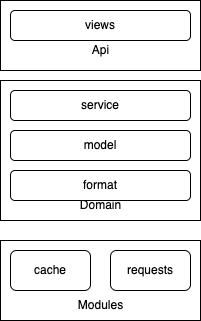

  


# KDP Catalog Manager

## 项目描述

### 项目概述
KDP Catalog Manager是一套大数据应用管理平台。基于应用功能进行分类查看、管理，降低应用管理的复杂度，从而使大数据管理人员更专注于数据的处理

### 核心技术架构



### 功能模块描述

#### api
* view  
定义 Restful API 并对用户输入参数执行基本验证及结果输出

#### Domain
* service  
业务逻辑
* format  
数据转换层，用于缓存数据与业务数据转换
* model  
数据模型实体


##### Modules
* cache  
数据存储层，静态数据存储于缓存中
* requests  
外部数据调用，调用外部服务获取数据


## 目录结构
```shell
├── CODEOWNERS
├── README.md
└── kdp_catalog_manager
   ├── api
   ├── common
   ├── config
   ├── main.py             # 服务启动程序
   ├── requirements.txt
   ├── test_main.py
   ├── domain
   ├── modules
   └── utils
```

## 启动方式
### 开发环境搭建
* 使用python3.10+

1. 克隆代码至本地
```shell
git clone xxx && cd kdp-catalog-manager
```

2. 使用虚拟环境
```shell
#安装virtualenv
pip install virtualenv
virtualenv -p /usr/local/bin/python3 venv
# 激活虚拟环境
source ./venv/bin/activate

# 关闭虚拟环境
deactivate
```

3. 安装依赖
```shell
pip install -r docker/python/requirements.txt
```

4. 服务启动
```shell
cd ~/kdp-catalog-manager \
&& export PYTHONPATH=$PYTHONPATH:$(pwd)
python kdp_catalog_manager/main.py

```

### API 手册
* 启动服务后通过 http://127.0.0.1:8000/docs 查看提供的接口列表